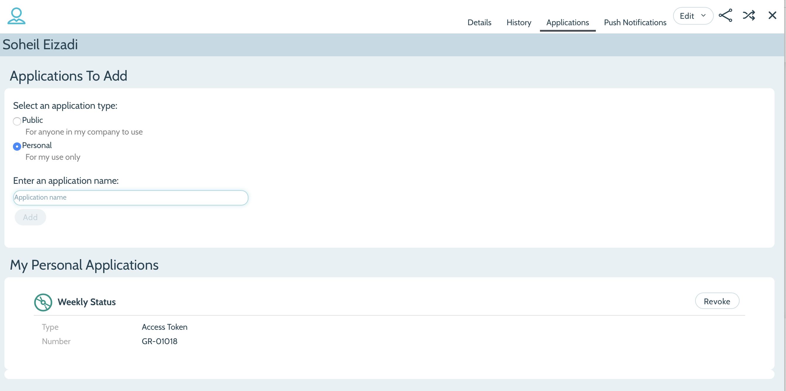

# versionone_scripts

## Configuration

To work on VersionOne you will need to create an access token. You do this
by going to your Applications and creating a Private Application and you will
be given an access token, you need to copy the value from the clipboard as it
will not be shown again. Here is the screenshot of the page after the
access token is created:



The endpoint and token can be written to the env.sh file, so it can be sourced in your shell prior to running the script.

## Using the script

A python interpreter is required to use this script (version 2.7 or 3 are both supported).

First define the environment to specify endpoint and token (API key). Either

```bash
export VERSION_ONE_ENDPOINT=https://www10.v1host.com/InfobloxNewV1
export VERSION_ONE_TOKEN=<v1 token>
export VERSION_ONE_DEFAULT_SCOPE='Athena 3.X'
```

Or

```bash
. env.sh
```

Then run the script, optionnally specifying:

- a target Portfolio (with __--scope__), otherwise uses VERSION_ONE_DEFAULT_SCOPE if set.
- a filter specific to TSA status(es) (with __--tsa_status__). The option accept a list of comma separated TSA Status values. If not specified, all statuses are returned.

```bash
# using default scope and iterating over all statuses:
./epics_export.py

# using default scope and filtering for 'Required' status:
./epics_export.py --tsa_status 'Required'

# getting items for Required and Done statuses:
./epics_export.py --tsa_status 'Required, Done'

# getting unset TSA Status for a given scope
./epics_export.py --scope 'Atlas 3.X' --tsa_status ''
```

Items are returned sorted by V1 Order by default. This may changed using the __--sort id__  option to return items sorted by their V1 Identifier instead.

```bash
# getting all items in scope sorted by id
./epics_export.py --sort id
```

## Modifying output

Output can be changed using the __--output pr__ control option, which will query all categories and output them grouped by section, ready to cut and paste in reports.

```bash
# reporting on all items in a Portfolio for reporting
./epics_export.py --scope 'Atlas 3.X' --output pr
```

## Extending the script queries

Extending the script capabilities requires to understand the VersionOne schema and the metadata specific to Infoblox. All metadata can be accessed using the following link:

<https://www10.v1host.com/InfobloxNewV1/meta.v1?xsl=api.xsl>
